# Capital Asset Pricing Model — Theory, Evidence, and an Out-of-Sample Reckoning

[](https://www.python.org/)
[](LICENSE)
[](tests/)
[](https://mba.tuck.dartmouth.edu/pages/faculty/ken.french/data_library.html)

A rigorous, reproducible empirical study of the **Capital Asset Pricing Model (CAPM)** that
replicates **Fama & French (2004), "The Capital Asset Pricing Model: Theory and Evidence"**
(*Journal of Economic Perspectives*, 18(3):25–46) — and then pushes every test **20+ years
past the paper**, into data the authors never saw, to ask: *did the story hold up?*

The CAPM is the centerpiece of every MBA finance course. It is also, in the words of its most
famous critics, an empirical failure. This project lets the data speak. Every number, table and
chart below is produced by the code in this repository from the **Kenneth R. French Data
Library** — the same CRSP/Compustat-derived data the paper uses.

---

## TL;DR — what the data says

- 📉 **The Security Market Line is too flat.** Across beta-sorted portfolios, the cross-sectional
  reward for beta is essentially zero (Fama-MacBeth slope **−0.6%/yr, t = −0.16**) when the CAPM
  predicts **+5.6%/yr**. Low-beta stocks earn *more* than the model says; high-beta stocks earn *less*.
- 💎 **Value and size beat the CAPM.** Over 1963–2003 the value spread (high minus low book-to-market)
  earned **7.8%/yr with a CAPM alpha of 8.2% (t = 2.9)** — return the market factor cannot explain.
- 🧪 **The CAPM is statistically rejected almost everywhere** (Gibbons-Ross-Shanken joint test). The
  **three-factor model rescues the size/value sorts**, but is itself **broken by momentum**.
- ⌛ **Out-of-sample (2004→today), the anomalies faded.** The size and value premiums have
  **collapsed to roughly zero** since the paper was published — a cautionary tale about data mining
  and crowded factors.
- 📚 **It looks like a publication effect.** Splitting each factor at its seminal paper, the anomaly
  premiums decay **48–95%** after publication while the market premium (the control) barely moves —
  the McLean-Pontiff pattern, reproduced here.
- 🌍 **The value premium is global — and so is its fade.** Value was significant across world markets
  (confirming Fama-French 1998), but weakened nearly everywhere after 2003, **vanishing in North
  America** while **Japan and emerging markets kept most of it.**
- 🎯 **Betting Against Beta works, modestly.** The strategy implied by the flat SML — lever up low-beta,
  short high-beta — earns a **positive CAPM alpha (≈ 2.3%/yr) with a beta of ≈ 0**, exactly as the
  flat-SML evidence predicts.

> **One-sentence verdict:** the CAPM is a beautiful theory and a poor description of average returns
> — *and the very anomalies that killed it have themselves decayed*, which is the most interesting
> twist the out-of-sample data adds to the 2004 paper.

---

## Table of contents

- [Background](#background)
- [Data & methodology](#data--methodology)
- [Results](#results)
  - [1. The flat Security Market Line](#1-the-flat-security-market-line-figure-2)
  - [2. Value and size](#2-value-and-size-figure-3)
  - [3. CAPM alphas decile by decile](#3-capm-alphas-decile-by-decile)
  - [4. The GRS joint test: which model prices what?](#4-the-grs-joint-test-which-model-prices-what)
  - [5. Factor premiums and momentum](#5-factor-premiums-and-momentum)
  - [6. Out-of-sample: the anomalies faded](#6-out-of-sample-the-anomalies-faded)
  - [7. The publication effect (McLean-Pontiff)](#7-the-publication-effect-mclean-pontiff)
  - [8. International evidence: is the fade global?](#8-international-evidence-is-the-fade-global)
  - [9. Betting Against Beta](#9-betting-against-beta)
- [Conclusions](#conclusions)
- [Reproduce it](#reproduce-it)
- [Project structure](#project-structure)
- [References](#references)
- [Disclaimer](#disclaimer)

---

## Background

The CAPM of Sharpe (1964) and Lintner (1965) makes one clean, testable claim:

> *The expected excess return of any asset is proportional to its market beta, and nothing else
> matters.*

$$ E[R_i] - R_f = \beta_{i} \, \big( E[R_M] - R_f \big) $$

Geometrically, all efficient portfolios are combinations of the risk-free asset and a single
tangency portfolio — which, in equilibrium, must be the market. Average returns should line up on a
straight **Security Market Line** through the origin (in excess-return space) with slope equal to
the equity premium.

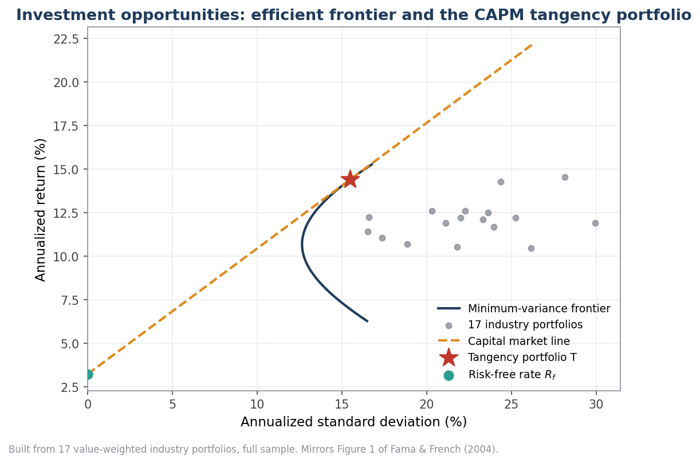

*The mean-variance frontier, capital market line and tangency portfolio, built from 17 real industry
portfolios. This is the geometry behind the CAPM (Figure 1 of the paper). The empirical question is
whether the **market proxy** actually sits on that frontier — and whether average returns line up
with beta. They do not.*

---

## Data & methodology

| | |
|---|---|
| **Source** | [Kenneth R. French Data Library](https://mba.tuck.dartmouth.edu/pages/faculty/ken.french/data_library.html) (CRSP/Compustat-derived), downloaded and cached automatically |
| **Frequency** | Monthly returns, in decimal form, net of the 1-month T-bill |
| **Factors** | Market (`Mkt-RF`), size (`SMB`), value (`HML`), momentum (`WML`) |
| **Test assets** | Beta / book-to-market / size / momentum deciles; 25 size×B/M portfolios; 17 industries |
| **Windows** | Paper windows **1927–2003** and **1963–2003**, plus an **out-of-sample 2004–present** extension |
| **Inference** | Newey-West (HAC) standard errors on all alphas; exact **Gibbons-Ross-Shanken** F-test for joint zero-alpha; **Fama-MacBeth** two-pass cross-sectional regressions |

All estimation avoids look-ahead. The Betting-Against-Beta legs are scaled by **trailing** rolling
betas only. The full study runs in a few seconds and is covered by a unit-test suite.

---

## Results

### 1. The flat Security Market Line (Figure 2)

The single most damaging fact about the CAPM: sort stocks into beta deciles, and the realized
relation between average return and beta is far **flatter** than the model predicts. The realized
line is dragged up on the left (low-beta stocks earn too much) and down on the right (high-beta
stocks earn too little).

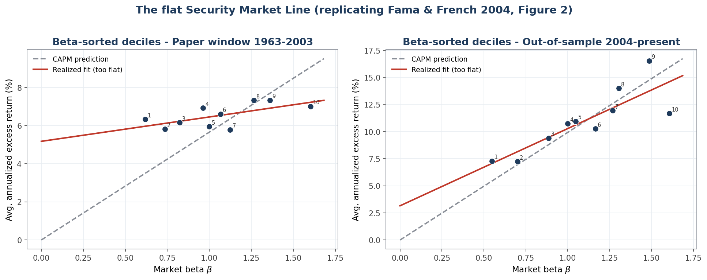

A Fama-MacBeth cross-sectional regression over **40 test portfolios** makes it quantitative:

| | CAPM prediction | Realized (1963–2003) |
|---|---|---|
| Cross-sectional **slope** on beta | **+5.65 %/yr** (the equity premium) | **−0.65 %/yr** (t = −0.16) |
| **Intercept** | **0** | **+7.46 %/yr** (t = 2.32) |

The slope that *should* equal the equity premium is statistically indistinguishable from zero, while
the intercept that *should* be zero is large and significant. This is the Black-CAPM symptom — a
real but far-too-flat trade-off — and it is exactly what the paper reports.

### 2. Value and size (Figure 3)

Sort instead on **book-to-market** (value) or **market cap** (size) and you get a wide spread of
average returns that beta completely fails to track. The highest-B/M ("value") decile has roughly
the *same* beta as the lowest ("growth") decile, yet earns far more.

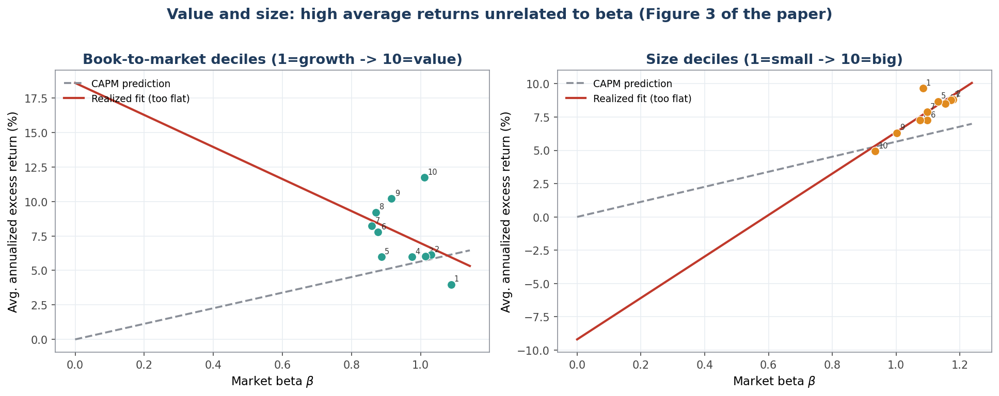

The long-short spreads, and the part of each spread the CAPM **cannot** explain:

| Sort (1963–2003) | Spread | Mean return | **CAPM alpha** | alpha t | spread beta |
|---|---|---:|---:|---:|---:|
| Book-to-market (value) | D10 − D1 | 7.8 %/yr | **8.2 %/yr** | **2.86** | −0.08 |
| Size | D1 − D10 | 4.7 %/yr | 3.9 %/yr | 1.23 | 0.15 |
| Momentum | D10 − D1 | 19.3 %/yr | **20.1 %/yr** | **6.36** | −0.16 |

The value and momentum spreads are almost *entirely* alpha — the market factor explains none of it
(the spread betas are ≈ 0).

### 3. CAPM alphas decile by decile

The same story, told as alphas. Under the CAPM, every bar should be zero. Instead alphas are
**systematically positive for low-beta / value** portfolios and **negative for high-beta / growth**
portfolios (t-statistics labelled above each bar).

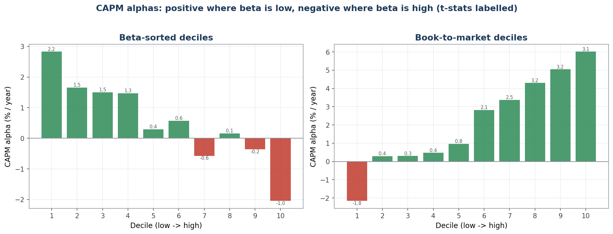

### 4. The GRS joint test: which model prices what?

The Gibbons-Ross-Shanken test asks whether *all* of a model's alphas are jointly zero. Green = the
model survives; red = it is rejected. The picture is the entire history of asset pricing in one
panel:

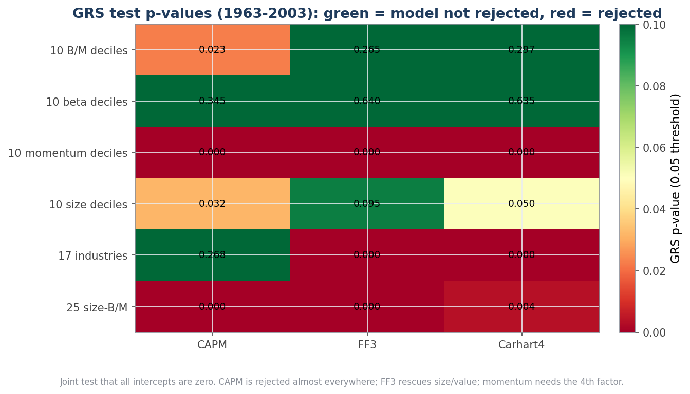

- **CAPM** is rejected on B/M, size, momentum and the 25 size×B/M portfolios.
- **Three-factor (FF3)** rescues the size and value sorts (p-values jump from 0.02–0.03 to 0.26–0.10)
  — the model's headline success.
- **Momentum** rejects *every* model that lacks a momentum factor (p ≈ 0).
- **Industries** remain stubborn even for FF3 — an honest reminder that no model prices everything.

### 5. Factor premiums and momentum

For 1927–2003 the estimated premiums and their t-statistics line up closely with the paper
(the paper reports market 8.3% at t≈3.5, SMB 3.6% at t≈2.1, HML 5.0% at t≈3.1; small differences in
the point estimates reflect 20+ years of CRSP/Compustat data revisions since 2004):

| Factor (1927–2003) | Premium %/yr | t-stat | Sharpe |
|---|---:|---:|---:|
| Market (Mkt−RF) | 7.81 | **3.55** | 0.40 |
| Size (SMB) | 2.73 | **2.08** | 0.24 |
| Value (HML) | 5.48 | **3.79** | 0.43 |
| Momentum (WML) | 9.03 | **4.78** | 0.55 |

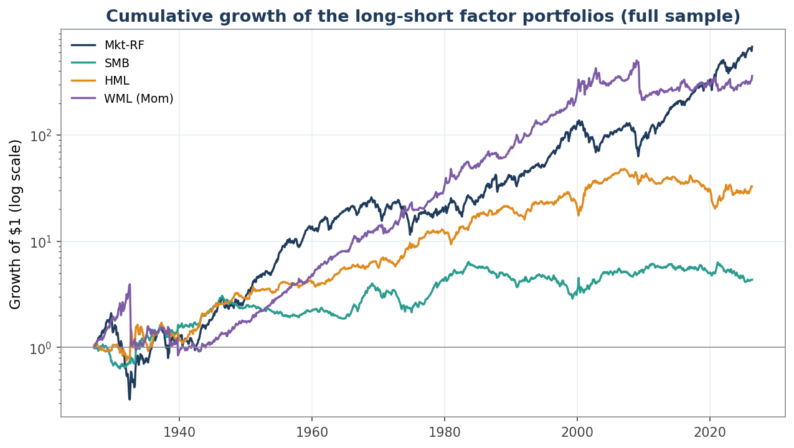

Momentum is the three-factor model's "most serious problem" (the paper's words). The winner-minus-loser
factor earns a large alpha that the CAPM **and** FF3 leave unexplained — and only collapses once a
momentum factor is added (Carhart four-factor):

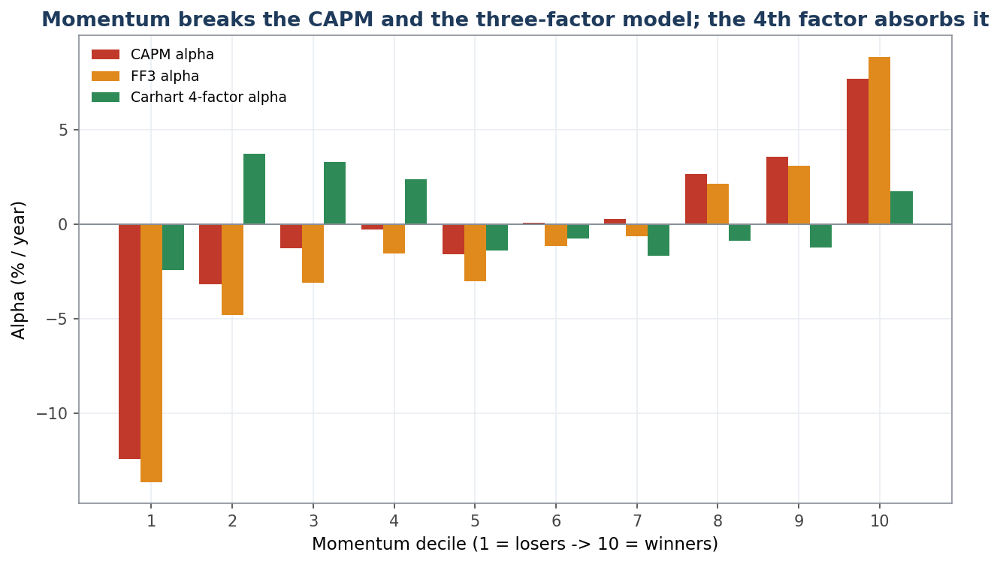

| Momentum factor (1963–2003) | Value |
|---|---|
| Mean return | 10.3 %/yr |
| **CAPM alpha** | **10.6 %/yr** (t = 5.3) |
| **FF3 alpha** | **12.5 %/yr** (t = 5.8) |

### 6. Out-of-sample: the anomalies faded

This is the part the 2004 paper could not write. Re-estimating the factor premiums on data **after**
publication tells a striking story: the **market premium is alive and well, but size and value have
essentially vanished.**

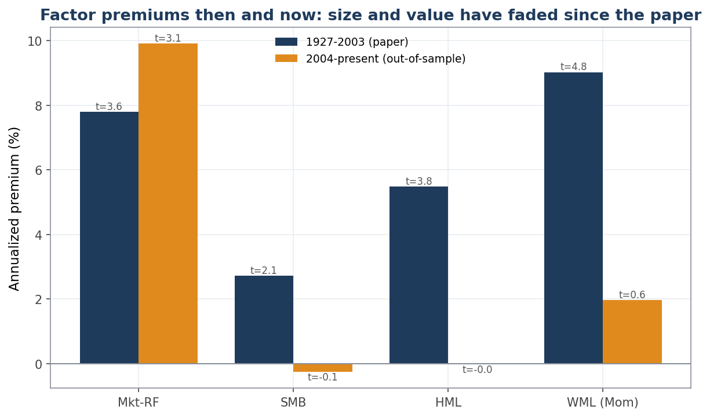

| Factor | 1927–2003 | **2004–present** |
|---|---:|---:|
| Market | 7.81 %/yr (t=3.6) | 9.92 %/yr (t=3.1) |
| Size (SMB) | 2.73 %/yr (t=2.1) | **−0.25 %/yr (t=−0.1)** |
| Value (HML) | 5.48 %/yr (t=3.8) | **−0.03 %/yr (t=−0.0)** |

The rolling 10-year premiums make the timing visible — value and size weaken right around the
publication of the anomaly literature, consistent with arbitrage crowding them out:

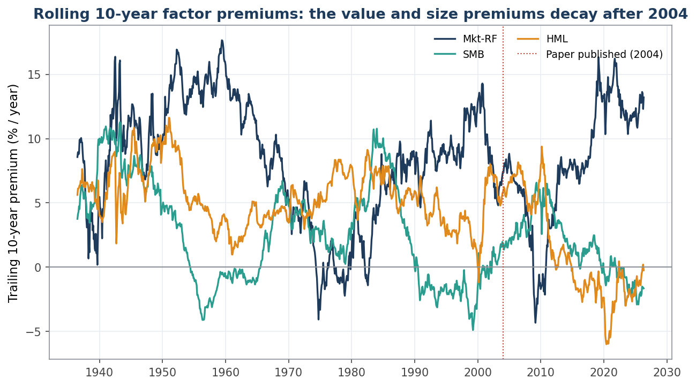

In the modern window the value *spread* even turns slightly **negative** (−1.2%/yr), and the GRS test
now *rejects the three-factor model itself* on B/M deciles. The lesson cuts in an unexpected direction:
the empirical regularities that buried the CAPM are not immutable laws either.

### 7. The publication effect (McLean-Pontiff)

If the anomalies faded *because* they were published and then arbitraged, the decay should line up
with publication dates — and the market premium, which was never an "anomaly", should be the control
that *doesn't* fade. McLean & Pontiff (2016) document exactly this pattern across ~100 anomalies (a
~58% post-publication decay). Splitting each factor at the year of its seminal paper reproduces it:

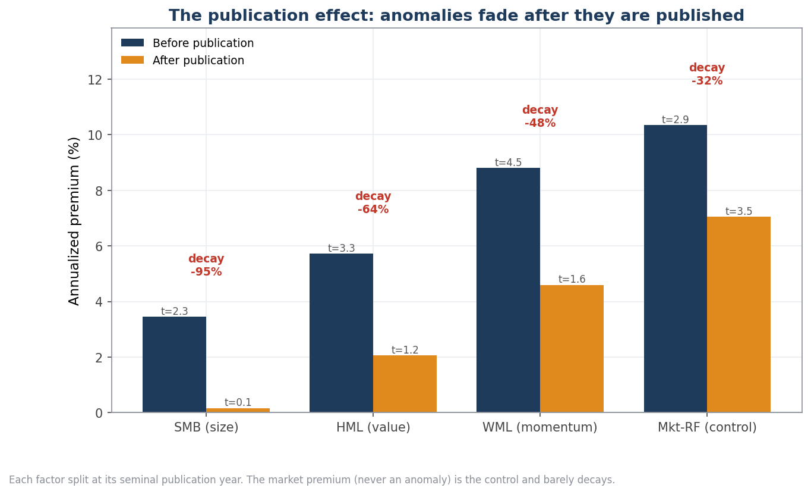

| Factor | Seminal paper | Before %/yr (t) | After %/yr (t) | **Decay** |
|---|---|---:|---:|---:|
| Size (SMB) | Banz (1981) | 3.5 (t=2.3) | 0.2 (t=0.1) | **−95 %** |
| Value (HML) | Rosenberg-Reid-Lanstein (1985) | 5.7 (t=3.3) | 2.1 (t=1.2) | **−64 %** |
| Momentum (WML) | Jegadeesh-Titman (1993) | 8.8 (t=4.5) | 4.6 (t=1.6) | **−48 %** |
| Market (control) | Sharpe (1964) — *not an anomaly* | 10.3 (t=2.9) | 7.0 (t=3.5) | −32 % |

The three anomaly premiums fall **48–95 %** and lose statistical significance after publication; the
market premium decays least and stays significant (t = 3.5). The average anomaly decay here (~69 %) is
even larger than McLean & Pontiff's headline. **Honest caveat:** for *single* factors the pre-vs-post
difference is not statistically significant given monthly volatility (Welch p ≈ 0.13–0.23) — which is
precisely why McLean & Pontiff pool many anomalies to gain power. The point estimates, and the clean
separation from the control, are the story.

### 8. International evidence: is the fade global?

Fama & French (1998) found the value premium in markets around the world — the paper cites this as
evidence the anomalies are not a US data-mining artifact. Using French's international factor files
(from 1990), the value premium is indeed significant across regions over the full sample. But splitting
at 2003 shows the **post-publication fade is global too — though uneven**:

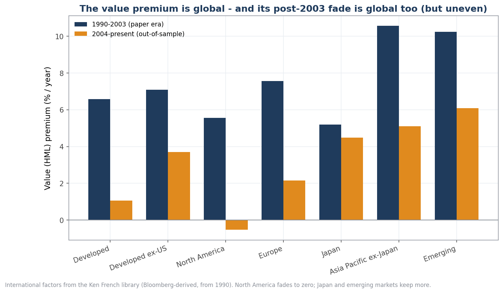

| Region (HML) | Full-sample %/yr (t) | 1990–2003 | **2004–present** |
|---|---:|---:|---:|
| Developed | 3.1 (t=2.1) | 6.6 | 1.1 |
| Developed ex-US | 5.0 (t=3.7) | 7.1 | 3.7 |
| North America | 1.8 (t=0.9) | 5.6 | **−0.5** |
| Europe | 4.2 (t=2.8) | 7.6 | 2.1 |
| Japan | 4.8 (t=2.6) | 5.2 | 4.5 |
| Asia Pacific ex-Japan | 7.2 (t=4.1) | 10.6 | 5.1 |
| Emerging | 7.7 (t=4.9) | 10.2 | 6.1 |

Value was — and still is — a worldwide phenomenon, but it has weakened nearly everywhere since the
paper, **collapsing to zero in North America** while **Japan and emerging markets retained most of it.**
That cross-sectional pattern is itself informative: if the fade were pure data-mining noise it would be
random across regions; instead it is strongest where markets are deepest and arbitrage capital is most
abundant — consistent with the crowding interpretation.

### 9. Betting Against Beta

If the SML is too flat, there is money on the table: lever up the cheap low-beta assets and short the
expensive high-beta ones, scaling each leg to a beta of one (Frazzini & Pedersen, 2014). Built from
the beta deciles, this self-financing, ex-ante beta-neutral portfolio earns a **positive CAPM alpha
with a market beta of essentially zero** — the tradeable signature of Figure 2.

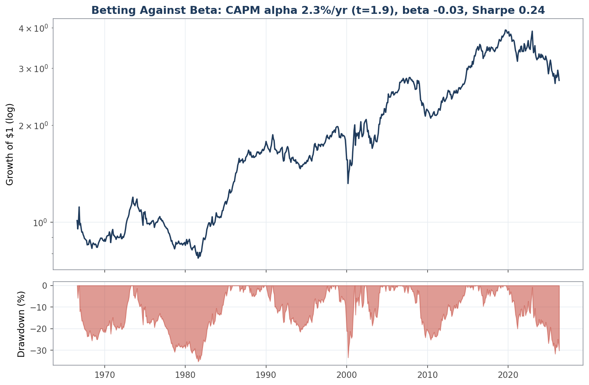

| Betting Against Beta | Full sample | 2004–present |
|---|---:|---:|
| CAPM alpha | **2.29 %/yr** (t = 1.92) | 1.86 %/yr (t = 1.09) |
| CAPM beta | −0.03 | −0.01 |
| Sharpe | 0.24 | 0.21 |
| Max drawdown | −35 % | −32 % |

*(This decile-based BAB is a deliberately conservative proxy — Frazzini & Pedersen's stock-level BAB
is stronger. The point here is the **sign and beta-neutrality**, which confirm the flat-SML
mechanism rather than chase a Sharpe ratio.)*

---

## Conclusions

1. **The Sharpe-Lintner CAPM is rejected by the data**, in exactly the ways Fama & French (2004)
   describe: the SML is too flat, and value/size/momentum carry returns beta cannot explain.
2. **The three-factor model is a genuine improvement** — it prices the size and value sorts — **but it
   is not a panacea**: momentum and industries defeat it.
3. **Out-of-sample, the anomalies decayed.** The size and value premiums that doomed the CAPM have
   themselves shrunk to ~zero since 2004. Factor investing is not a free lunch, and published edges erode.
4. **It really looks like a publication effect.** The decay tracks each factor's publication date, the
   never-published market premium is the control that survives, and — across regions — the fade is
   strongest where arbitrage capital is deepest (North America) and mildest where it is thinnest
   (Japan, emerging markets). That is the crowding signature, not random noise.
5. **The flat SML is tradeable** (Betting Against Beta), and its near-zero market beta is a clean
   internal consistency check on the whole exercise.

This is a faithful replication plus an honest out-of-sample reckoning: the CAPM's failures are real and
reproducible, *and* the factors that replaced it are not immutable laws either.

The CAPM remains, as the authors put it, *"a theoretical tour de force"* — indispensable for teaching,
unreliable for application.

---

## Reproduce it

```powershell
# Windows / PowerShell
py -3.12 -m venv .venv
& ".venv\Scripts\Activate.ps1"
pip install -r requirements.txt

pytest -q                          # 13 tests
python scripts/run_study.py        # downloads + caches data, writes output/tables/ and output/RESULTS.md
python scripts/build_figures.py    # renders output/figures/*.png
```

```bash
# macOS / Linux
python3.12 -m venv .venv
source .venv/bin/activate
pip install -r requirements.txt
pytest -q && python scripts/run_study.py && python scripts/build_figures.py
```

The first run downloads ~10 datasets from the French library and caches them under `data/cache/`;
subsequent runs are fully offline. Generated tables live in [`output/RESULTS.md`](output/RESULTS.md).

---

## Project structure

```
src/capm/
  data/        download + cache + parse the Ken French datasets (robust to the
               library's quirky multi-section CSV layout; deciles -> D1..D10)
  stats/       OLS with Newey-West HAC errors, the GRS test, Fama-MacBeth,
               and performance metrics (Sharpe, Sortino, drawdown, Calmar)
  empirics/    the studies: flat SML, value/size/momentum sorts, factor
               premiums, the GRS panel, momentum, the publication effect,
               international evidence, and Betting Against Beta
  reporting/   matplotlib styling and the twelve figures
scripts/
  run_study.py      run everything, write tables + RESULTS.md
  build_figures.py  render all figures
tests/         pytest suite (regression/HAC, GRS, metrics, data parser)
output/        committed figures and result tables
```

The architecture is a one-directional pipeline — `data → stats → empirics → reporting` — so each
layer is independently testable and the financial logic is isolated from I/O and plotting.

---

## References

- Fama, E. F., & French, K. R. (2004). **The Capital Asset Pricing Model: Theory and Evidence.**
  *Journal of Economic Perspectives*, 18(3), 25–46. *(the paper replicated here)*
- Sharpe, W. F. (1964). Capital Asset Prices: A Theory of Market Equilibrium under Conditions of Risk.
  *Journal of Finance*, 19(3), 425–442.
- Lintner, J. (1965). The Valuation of Risk Assets and the Selection of Risky Investments.
  *Review of Economics and Statistics*, 47(1), 13–37.
- Black, F. (1972). Capital Market Equilibrium with Restricted Borrowing. *Journal of Business*, 45(3).
- Fama, E. F., & MacBeth, J. D. (1973). Risk, Return, and Equilibrium: Empirical Tests.
  *Journal of Political Economy*, 81(3), 607–636.
- Fama, E. F., & French, K. R. (1993). Common Risk Factors in the Returns on Stocks and Bonds.
  *Journal of Financial Economics*, 33(1), 3–56.
- Gibbons, M. R., Ross, S. A., & Shanken, J. (1989). A Test of the Efficiency of a Given Portfolio.
  *Econometrica*, 57(5), 1121–1152.
- Jegadeesh, N., & Titman, S. (1993). Returns to Buying Winners and Selling Losers.
  *Journal of Finance*, 48(1), 65–91.
- Carhart, M. M. (1997). On Persistence in Mutual Fund Performance. *Journal of Finance*, 52(1), 57–82.
- Frazzini, A., & Pedersen, L. H. (2014). Betting Against Beta. *Journal of Financial Economics*, 111(1).
- Fama, E. F., & French, K. R. (1998). Value versus Growth: The International Evidence.
  *Journal of Finance*, 53(6), 1975–1999.
- McLean, R. D., & Pontiff, J. (2016). Does Academic Research Destroy Stock Return Predictability?
  *Journal of Finance*, 71(1), 5–32. *(the publication-effect benchmark)*
- Banz, R. W. (1981). The Relationship Between Return and Market Value of Common Stocks.
  *Journal of Financial Economics*, 9(1), 3–18.
- Newey, W. K., & West, K. D. (1987). A Simple, Positive Semi-Definite, Heteroskedasticity and
  Autocorrelation Consistent Covariance Matrix. *Econometrica*, 55(3), 703–708.
- **Data:** Kenneth R. French Data Library —
  <https://mba.tuck.dartmouth.edu/pages/faculty/ken.french/data_library.html>

---

## Disclaimer

This is an educational and research project. Nothing here is investment advice. Past performance of
any factor or strategy does not guarantee future results — indeed, demonstrating that some of these
premiums *did not* persist is one of the project's findings.

Licensed under the [MIT License](LICENSE).
